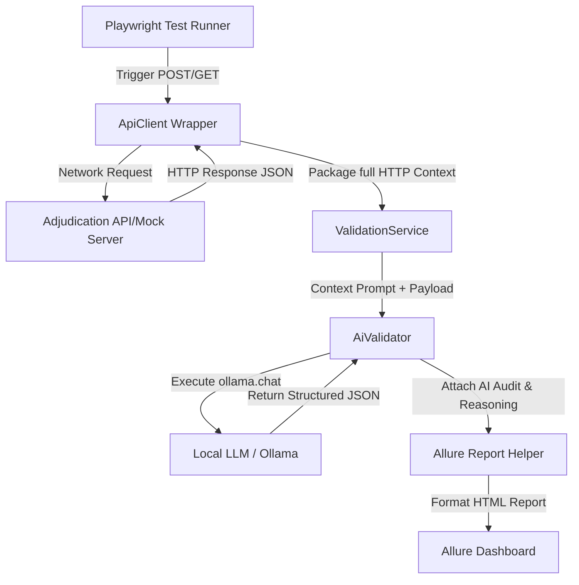

# AI-Powered API Validation Framework

This framework represents a modern, enterprise-ready approach to API testing and business-logic verification. It combines the speed and reliability of **Playwright (TypeScript)** for API execution with the cognitive analysis of a **Local LLM (Ollama + Llama3)** to audit complex pharmacy claim adjudications, member eligibility, and pricing rules.

---

## 🌟 Benefits of this Framework

### 1. Dynamic Business Logic Verification
Traditional test automation uses static assertions (e.g., checks for JSON schemas or exact value matches). This framework uses a Local LLM to analyze the *context* and *clinical business rules* of responses. For example, it checks if a rejection code logical relationship is correct, or if patient co-pays make sense for the drug class.

### 2. Zero-Dependency Local Testing (Mock LLM Fallback)
If Ollama is not installed locally or is offline, the framework automatically triggers an **intelligent mock fallback mode** (`MOCK_LLM=true`). The mock mode simulates logical clinical reasoning and calculation audits programmatically, ensuring test runs succeed in local environments or sandboxed CI/CD pipelines.

### 3. Integrated Adjudication Simulator
The framework comes equipped with a built-in mock HTTP API server that spins up dynamically on port `3001` prior to test execution. This allows testing of genuine HTTP request/response payloads, headers, and status codes.

### 4. Rich Technical Reporting
Integrating with **Allure Reporting** enables attaching:
* Full HTTP request headers and payloads.
* Full HTTP response headers, payloads, and latency.
* AI validation prompt contexts and structured JSON reasoning records.

---

## 🏗️ Architecture & How It Works

### 1. API Validation Flow
The framework executes a step-by-step verification pipeline for every transaction:


### 2. How the Local LLM (Ollama) is Called & Why It's Integrated

#### How it is Called in Code
The framework accesses the local server using the official `ollama` Node.js client. In [aiValidator.ts](file:///c:/Users/mvsar/Projects/AIPLAYWRIGHTMCP/src/ai/aiValidator.ts), the connection and prompting are managed as follows:

```typescript
import ollama from 'ollama';

// Configure the Ollama API host (Defaults to http://localhost:11434)
process.env.OLLAMA_HOST = env.ollamaHost;

const response = await ollama.chat({
  model: 'llama3',
  messages: [{ role: 'user', content: prompt }],
  format: 'json', // Enforces valid JSON syntax in the output
  options: {
    temperature: 0.1, // Near-zero temperature minimizes creative variation and maximizes audit consistency
  }
});

const responseText = response.message.content;
const validationResult = JSON.parse(responseText);
```

#### Why Integrate a Local LLM (Ollama) in this Project?
1. **Dynamic Reasoning Over Complex Healthcare Contracts**: 
   Standard automation is limited to matching rigid properties (e.g., checking if `status` equals `200` or a property is defined). However, healthcare adjudication requires evaluating logical contradictions across multiple fields. For example, the LLM checks:
   * Is a Specialty drug being processed as a generic Tier-1 drug?
   * If a claim is rejected, is the rejection description contextually aligned with standard PBM regulations?
   * Does the member copay make mathematical sense compared to their deductible accumulation?
2. **Strict Data Privacy (HIPAA Compliance)**:
   Healthcare records are regulated under HIPAA, prohibiting the transmission of Protected Health Information (PHI) to third-party public cloud APIs (like OpenAI or Anthropic) without expensive Business Associate Agreements (BAAs). Because Ollama hosts `llama3` **entirely on your local hardware**, all claims, pricing records, and eligibility payloads are validated offline with **zero data leakage**.
3. **Reduced Cost and Latency at Scale**:
   Auditing thousands of regression tests using public APIs incurs severe token costs and network overhead. Running Ollama locally eliminates per-token API charges and provides predictable execution speeds.

### 3. Future Model Context Protocol (MCP) Integration
Model Context Protocol (MCP) is a standard that allows LLMs to interact securely with external tools and resources:
* **Filesystem MCP (`src/mcp/filesystem`)**: Will expose filesystem tools (`read_file`, `write_file`, `list_directory`) to the LLM. The LLM can read offline claim EDI files or local insurance plans to verify that the drug is eligible before sending the API request.
* **PostgreSQL MCP (`src/mcp/postgres`)**: Will expose database querying tools. This will enable the LLM to run database checks (e.g. querying DB tables to confirm the member's deductible accumulator was updated after the API returned a status of `PAID`).

---

## 📂 Project Directory Structure

```
ai-api-validator/
│
├── src/
│   ├── ai/
│   │   ├── aiValidator.ts         # Handles Ollama communication, structured JSON output, and mock fallback
│   │   └── validationService.ts   # Contextual prompt wrappers (Claims, Eligibility, Pricing)
│   │
│   ├── config/
│   │   └── environment.ts         # Config settings loaded from environment variables
│   │
│   ├── mcp/                       # Placeholders for future Model Context Protocol servers
│   │   ├── filesystem/            # For reading raw claims/eligibility files
│   │   └── postgres/              # For database accumulator assertions
│   │
│   ├── tests/
│   │   ├── fixtures/
│   │   │   └── mockClaimsData.ts  # Realistic pharmacy claim datasets (Metformin, Humira, Nexium)
│   │   └── claimValidation.spec.ts# Core test runner executing mock server & 7 API scenarios
│   │
│   └── utils/
│       ├── apiClient.ts           # Playwright APIRequestContext wrapper
│       ├── logger.ts              # Timestamps and logging severity levels
│       └── reportHelper.ts        # Attaches request, response, and AI logic to Allure
│
├── .env                           # Local environment configuration file
├── .env.example                   # Environment configuration template
├── package.json                   # Scripts, dependencies, and devDependencies
├── playwright.config.ts           # Playwright orchestration and Allure plugin config
└── tsconfig.json                  # TypeScript compiler rules
```

---

## 🛠️ Step-by-Step Setup

### 1. Node.js Installation
Ensure you have **Node.js** (v18+) installed. Clone or enter the project directory and install dependencies:
```bash
npm install
```

### 2. Ollama Local LLM Setup
To enable live AI validation, install Ollama locally:
1. **Download Ollama**: Download the setup installer for Windows from [ollama.com/download/windows](https://ollama.com/download/windows) and run it.
2. **Download Llama 3 Model**: Open PowerShell/Terminal and download Llama 3 (approx. 4.7 GB):
   ```bash
   ollama pull llama3
   ```
3. **Verify Ollama is Running**:
   * Navigate to `http://localhost:11434` in your browser. You should see `"Ollama is running"`.
   * Run `ollama list` in your terminal to verify `llama3:latest` is successfully downloaded and registered.

---

## 🚀 Environment Configuration & Execution

The framework is configured by default to run in simulated mode, but can be switched to real LLM execution:

### 1. Configure for Real AI Mode
Open the [.env](file:///.env) file in the root directory and toggle the `MOCK_LLM` flag to `false`:
```env
# Set to false to bypass the mock client and query your local Ollama LLM
MOCK_LLM=false
```

### 2. Run Playwright Tests
Execute the test runner suite:
```bash
npx playwright test
```
*Note: The first execution under live AI mode may take slightly longer (around 5-10s) as Ollama loads Llama 3 into system memory.*

### 3. Generate HTML Allure Reports
Compile the gathered test runs and metadata into the visual HTML report dashboard:
```bash
npm run report:generate
```

### 4. View Allure Reports
Start a local server to view the generated report in your web browser:
```bash
npm run report:open
```

### 5. Clean Previous Report Assets
Wipe the temporary results and reports directories:
```bash
npm run clean
```

---

## 🧪 Deep Dive: Spec Files Analysis

### [claimValidation.spec.ts](file:///c:/Users/mvsar/Projects/AIPLAYWRIGHTMCP/src/tests/claimValidation.spec.ts)
This is the core test orchestrator. It manages the following steps:

1. **Adjudication Simulator Setup (`beforeAll`/`afterAll`)**:
   Spins up a local Node.js HTTP server on port `3001` that mimics a Pharmacy Benefits Manager (PBM) API gateway. It resolves requests dynamically based on standard endpoints:
   * `POST /api/claims/metformin` (Standard Paid Claim)
   * `POST /api/claims/humira` (Specialty Rejection, Code 75)
   * `POST /api/claims/nexium` (Non-Formulary Rejection, Code 70)
   * `GET /api/eligibility/active` (Active member)
   * `GET /api/eligibility/inactive` (Lapsed coverage)
   * `GET /api/pricing/correct` (Correct discount math)
   * `GET /api/pricing/incorrect` (Calculated discrepancy)

2. **Network Client & Context (`ApiClient`)**:
   Tests invoke the `ApiClient` wrapper, making real HTTP requests against the mock server and recording structured metadata (such as latency).

3. **Logical Verification & Adjudication Rules (`ValidationService`)**:
   Responses are handed to the AI validation routines. The AI evaluates the JSON payload based on context-specific healthcare prompts (e.g. comparing member copays, confirming that rejection descriptions match standard PBM codes, and looking for pricing mismatches).

4. **Reporter Integrations (`ReportHelper`)**:
   Attaches the API payload details and AI reasoning summaries directly into the Allure reporter context.

5. **Assertions**:
   Verifies that the status returned by the AI (`PASS` or `FAIL`) and the reasoning match the expected business rules.
